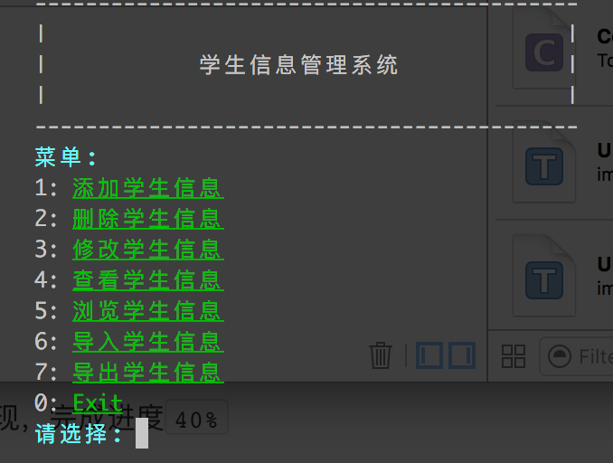
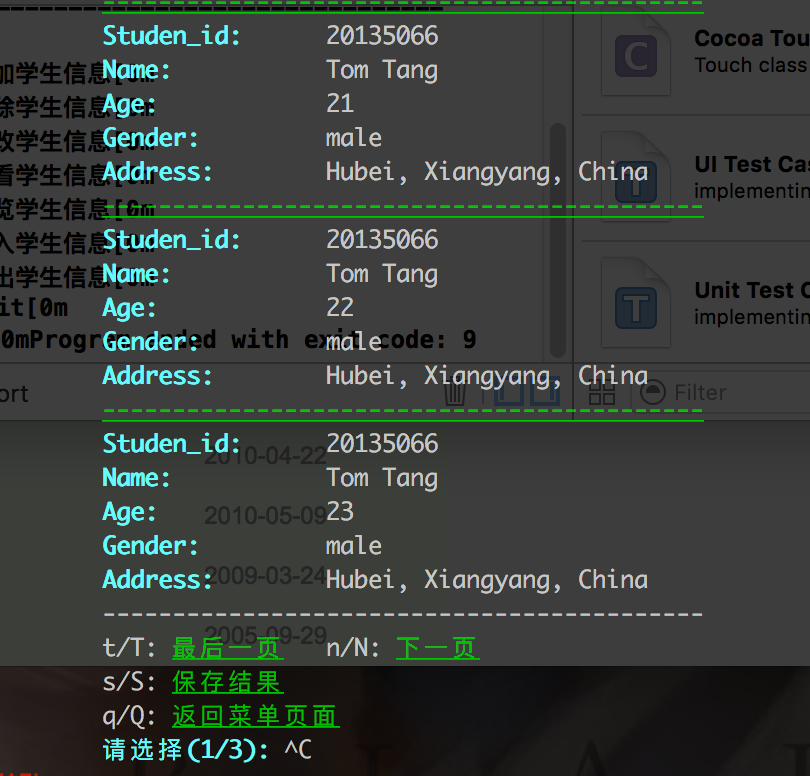
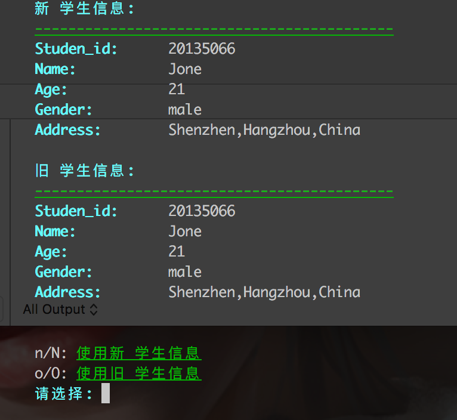

# C, C++, Objective-C学习笔记

## 简介
```
----code
    |
    |----StudentInfomationManagementSystem
    |
----note
    |
    |----1-1 C复习.md(c语言学习笔记)
```

## Chalk

`Chalk`类库用于实现终端下的彩色输出，支持高亮，多种颜色等。

你可以在`code/StudentInfomationManagementSystem`中找到原文件。


你可以这样使用

```c
#include "chalk.h"

// ....

Chalk *chalk = (Chalk *)malloc(sizeof(Chalk));
initialize_chalk(chalk);
chalk->setForecolor(chalk, "green");
// ... 其他一些配置 参见.h文件
chalk->print(chalk, message); // 打印输出
```

## 学生信息管理系统

基于纯C，面向过程实现，完成进度`40%`








